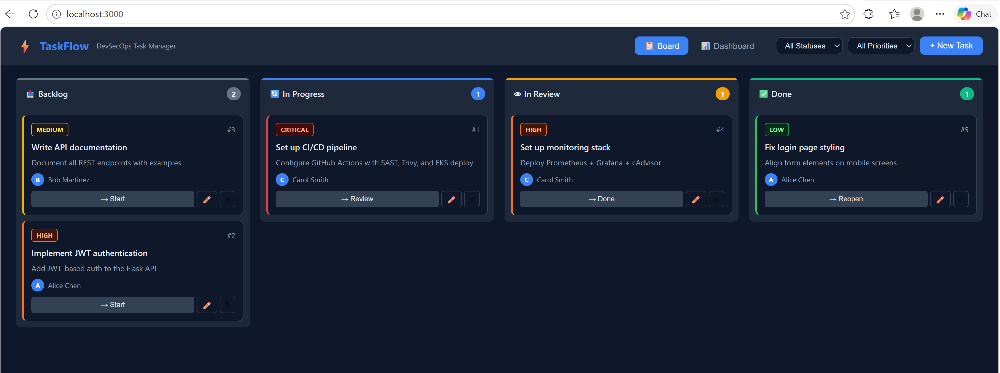

# Docker Mastery Project
## George Awa, CISSP | DevSecOps Engineer | Project 5

A hands-on Docker mastery project working through every core concept from
basic container commands to production-grade hardened images, multi-container
Compose stacks, network isolation, and security scanning. All modules
practiced locally and committed to GitHub as portfolio evidence.

---

## Progress Tracker

| Module | Topic | Status |
|--------|-------|--------|
| 1 | Docker Basics — images, containers, inspect | Complete |
| 2 | Dockerfile — basic, multi-stage, hardened | Complete |
| 3 | Docker Compose — TaskFlow full-stack app | Complete |
| 4 | Docker Networking — zero-trust isolation | Complete |
| 5 | Docker Volumes | Complete |
| 6 | Docker Security Audit | Complete |

---

## Module 1 — Docker Basics

What was practiced:
- Pulled nginx:alpine, python:3.12-alpine, redis:7-alpine
- Alpine images are 40-60MB vs 1GB+ for full images
- Ran nginx container with port mapping -p 8080:80
- Shelled inside running container with docker exec -it
- Extracted files from container with docker cp
- Read container metadata with docker inspect

Security findings from docker inspect:
- Container ran as root — fixed in Module 2
- ReadonlyRootfs: false — fixed in Module 2
- Memory: 0 (no limit) — fixed in Module 2

---

## Module 2 — Dockerfile and Multi-Stage Builds

Three images built and compared:

| Image | Base | Size | User | Gunicorn |
|-------|------|------|------|----------|
| docker-mastery-basic:v1 | python:3.12-slim | 133MB | root | no |
| docker-mastery-multistage:v1 | python:3.12-slim | 125MB | root | yes |
| docker-mastery-hardened:v1 | python:3.12-alpine | 60MB | appuser | yes |

55% size reduction from basic to hardened.

Security hardening proved:
- whoami returned appuser — NOT root
- uid=1000(appuser) gid=101(appgroup)
- Write to /app blocked — read-only filesystem confirmed
- Write to /tmp/app allowed — gunicorn temp dir works

---

## Module 3 — Docker Compose and TaskFlow Full-Stack App

Built a real production full-stack application.

### TaskFlow — DevSecOps Task Manager

Stack:
- React 18 frontend — Kanban board and Dashboard
- Python Flask REST API — CRUD, Redis caching, audit logging
- PostgreSQL 16 — tasks, users, audit_logs tables
- Redis 7 — API response caching with 30s TTL
- Nginx — serves React, proxies /api requests to Flask

Run it:
cd taskflow
mkdir -p secrets
echo "TaskFlowDBPass2024!" > secrets/db_password.txt
docker compose up -d --build

Open http://localhost:3000

Docker Compose concepts demonstrated:
- Docker secrets — DB password never in environment variables
- Named volumes — postgres_data and redis_data persist across restarts
- Network isolation — frontend bridge and backend internal: true
- Health checks with depends_on condition: service_healthy
- Resource limits — memory and CPU limits on all services
- cap_drop ALL and no-new-privileges on API container

All 4 containers healthy:
- taskflow-postgres Healthy
- taskflow-redis Healthy
- taskflow-api Healthy
- taskflow-frontend Started on http://localhost:3000

---

## Module 4 — Docker Networking

Zero-trust network isolation proved with live tests:

| Test | Result | Proves |
|------|--------|--------|
| ping net-test-2 by name | 0% packet loss | Docker DNS resolves container names |
| ping 8.8.8.8 from internal network | 100% packet loss | internal: true blocks all internet |
| ping 8.8.8.8 from bridge network | 0% packet loss | Bridge network has full internet |
| ping across different networks | bad address | Containers invisible across networks |
| ping after docker network connect | 0% packet loss | Controlled bridge like taskflow-api |

How this maps to TaskFlow:
- taskflow_frontend internal: false — nginx can reach internet
- taskflow_backend internal: true — postgres and redis cannot reach internet
- If postgres is compromised it cannot make outbound connections or exfiltrate data

---
## Module 5 — Docker Volumes

Three volume types proved with live tests.

| Type | Test | Result |
|------|------|--------|
| Named volume | Data persists across containers | Proved |
| Named volume | Two containers share live data | Proved |
| Bind mount | Host files visible inside container | Proved |
| Bind mount | Read-only blocks writes | Proved |
| tmpfs | In-memory, never hits disk | Proved |
| Volume backup | tar from volume to host | Proved |

Key findings:
- Named volumes at /var/lib/docker/volumes/ — Docker managed
- taskflow_postgres_data persists your TaskFlow tasks across restarts
- Bind mount :ro flag blocked write attempt — host files protected
- tmpfs never touches disk — ideal for secrets and session tokens
- Volume backup with tar using a temporary container

Commands learned:
docker volume create name
docker volume ls
docker volume inspect name
docker run -v volume:/path container
docker run -v folder:/path:ro container
docker run --tmpfs /tmp:rw,noexec,nosuid,size=64m container
export MSYS_NO_PATHCONV=1 — required on Windows Git Bash

## Project Structure

docker-mastery/
- app/ — Flask app used across modules
- dockerfiles/basic/ — Module 2 learn Dockerfile instructions
- dockerfiles/multi-stage/ — Module 2 reduce image size
- dockerfiles/hardened/ — Module 2 production security hardening
- compose/web-stack/ — Flask PostgreSQL Redis Nginx
- compose/monitoring-stack/ — Prometheus Grafana cAdvisor
- taskflow/ — Module 3 full-stack React app with screenshot
- networking/ — Module 4 networking demo script
- volumes/ — Module 5 volumes demo script
- security/ — Module 6 security audit script
- docs/ — module notes and networking examples

---

## Security Concepts Demonstrated

| Concept | Where Applied | Module |
|---------|--------------|--------|
| Non-root user appuser UID 1000 | hardened Dockerfile | 2 |
| Read-only filesystem | hardened Dockerfile | 2 |
| Alpine base 60MB vs 133MB | hardened Dockerfile | 2 |
| Multi-stage build | all production images | 2 |
| Docker secrets not env vars | TaskFlow Compose | 3 |
| Network isolation internal: true | TaskFlow Compose | 3 |
| Health checks with depends_on | TaskFlow Compose | 3 |
| Resource limits memory and CPU | TaskFlow Compose | 3 |
| cap_drop ALL | TaskFlow API container | 3 |
| no-new-privileges | TaskFlow API container | 3 |
| Zero-trust proved with ping tests | Networking module | 4 |

---

## Frameworks Addressed

- CIS Docker Benchmark — non-root, read-only, no privileged containers
- NIST 800-190 — Application Container Security Guide
- OWASP Docker Security — secrets management, network isolation
- PCI-DSS — Req 1 network segmentation, Req 6.3 vulnerability management

---

## Author

George Awa, CISSP | DevSecOps Engineer
LinkedIn: https://linkedin.com/in/georgeawa
GitHub: https://github.com/desbain